<div align="center">



**Version control for the folder your video editor already uses.**

[](#license)
[](https://www.rust-lang.org/)
[](https://github.com/ssmurfgg04-gif/cairn/releases/latest)
[](https://github.com/ssmurfgg04-gif/cairn/stargazers)
[](https://github.com/ssmurfgg04-gif/cairn/commits/main)

</div>

**What is Cairn? (plain language.)** It is version control for the folder
your video editor already uses. You keep working in Premiere, Resolve, or
Blender exactly as today; Cairn watches the project folder, and every save
becomes a durable version — synced to your teammates and to a meeting-point
server you (or we) host. Only the changed pieces move (files are split into
content-addressed chunks, deduplicated, and compressed), a crash mid-save
or mid-upload loses nothing, and opening a huge file that is not fully
downloaded yet serves what the editor needs first (placeholder hydration).
No check-in ritual, no "copy_final_v7_REAL" — save, and the other cut stays
in sync with a conflict copy when two people genuinely collide.

> Git-style versioning, FastCDC chunking, BLAKE3 integrity, placeholder hydration for NLE media.
> Headless core: sync engine, storage server, local daemon, CLI. The ctl API is a deliverable.

**Name (ADR-0002):** a *cairn* is a deliberate stack of stones marking a route — every stone is
unique and immutable (content-addressed chunks), the stack marks the trail (journal + cursors),
each summit is a checkpoint (snapshots/refs), and it survives weather (crash safety, I2).

## Repository layout

```
crates/
  cairn-proto wire protocol v4 (tonic/prost), package cairn.v4, fields 100-199 reserved
  cairn-tl OTIO/FCPXML three-way timeline merge (ADR-0015): exact rationals,
  identity ladder, C0-C10 classifier, canonical serializer, FCPXML bridge
  cairn-tray Windows system tray (ADR-0016): thin onboarding layer over cairn-cli
  cairn-core chunk/hash/manifest/compress/bloom/error-taxonomy (pure, heavily tested)
  cairn-store local CAS + client SQLite (WAL) + outbox + header cache
  cairn-sync sync engine: state machine, AIMD uploader, conflict copies, fold
  cairn-server metadata plane + control-plane jobs + data-plane presigning
  cairn-cli CLI + local daemon (ctl gRPC :17777, local dashboard :17778)
  cairn-review client review portal: version stack, guest links, frame notes (ADR-0028)
  cairn-p2p NAT traversal + swarm: STUN, relay, mDNS, signal, sessions
  cairn-quic QUIC transport: endpoints, relay, trust (transport experiment track)
  cairn-proxy media proxy pipeline: FFmpeg transcode ladders (ADR-0020)
  cairn-fec forward error correction (redundant chunk repair)
  cairn-shell-ext Windows shell extension: Explorer overlay badges
  cairn-app native Windows console shell (Tauri) over the dashboard (ADR-0022)
  cairn-sim deterministic simulation suite (I2 enforcement)
  cairn-fs-linux FUSE (fuser)
  cairn-fs-mac File Provider shim (cfg(target_os = "macos"))
  cairn-fs-win CfAPI via windows-rs (cfg(windows))
  cairn-x e2e + fault-injection harness (kill -9 at every step), golden corpus
proto/cairn/v4 .proto source of truth
docs/ SPEC.md, adr/, ctl-api.md, runbooks/, STATUS.md
```

## Download & install

**Windows (recommended):** grab`cairn-setup-<tag>.exe` from the
[latest release](https://github.com/ssmurfgg04-gif/cairn/releases/latest)
and double-click it — per-user NSIS installer (no admin), license page,
Start-Menu shortcut, optional SHA256-pinned ffmpeg component, tray
autostart, daemon starts hidden at the end; the finish page opens the
dashboard at`http://127.0.0.1:17778`. The installer is built and
gate-tested (silent install → live daemon →`status --json` → uninstall →
autostart removed) on every`v*` tag by
[.github/workflows/installer.yml](.github/workflows/installer.yml); the
contract it shares with the scripted path is documented in
[installer/windows/README.md](installer/windows/README.md). It is unsigned
in this beta — SmartScreen's "More info → Run anyway" applies.

**Windows (scripted):**

```powershell
irm https://raw.githubusercontent.com/ssmurfgg04-gif/cairn/main/install.ps1| iex
```

**Self-hosting the meeting point** (two homes / two studios syncing through
a server you control):`docs/runbook-meeting-point.md` — hardened systemd
units (`deploy/`), a multi-stage Dockerfile + compose with TLS termination,
the verified env-knob table, backups, and the honest admission-gap notes
(what works today, what is still tracked debt).

Both install paths lay down the SAME per-user layout
(`%LOCALAPPDATA%\Programs\Cairn` + the`CairnTray` autostart key) and are
interchangeable on the same machine. Either one puts the engine + system
tray in place (tray icon in the notification area: connect a project
folder, check status, open the project — no terminal needed; ADR-0016).
The CLI path below remains for servers and power users.

**What you're evaluating:** the merge is`cairn tl-merge --base b.otio
--ours a.otio --theirs b2.otio` (exit 0 clean / 1 notes / 2 conflicts / 3
refused) — add`--semantic` to auto-merge frame-disjoint re-cuts
(ADR-0023, opt-in). Also new:`cairn tl-branch` (git-for-video),
`cairn search` (find clips by what's IN them),`cairn review
export-changelist| apply-changelist` (client notes → mechanical edits,
with a YES/NO gate), and live presence between editors (daemon flag
`live_presence`, off by default). The honest competitive ledger — where
we win, where LucidLink and friends win — is
[docs/COMPETITIVE.md](docs/COMPETITIVE.md).

## Quick start

```sh
just build # cargo build --workspace
just test # cargo nextest run --workspace
just clippy # pedantic on core crates, -D warnings in CI
just sim # deterministic simulation suite
just run-server # metadata+data plane on :7443 (dev TLS off)
just run-daemon # local ctl gRPC :17777 + dashboard :17778
just doctor # end-to-end health check
```

## The two questions every design argument resolves against

- **I1:** "I opened a 50GB BRAW in Resolve — how long until I can scrub?" (<50ms cached header serve)
- **I2:** "A crash happened at any point — did we lose an acknowledged save or corrupt a project
  file?" (Answer must always be: **no**.)

Read`SPEC.md` first. Every deviation from it is a bug unless an ADR in`docs/adr/` says otherwise.
Ported/studied code provenance lives in`THIRD_PARTY.md`. The frozen control contract lives in
`docs/ctl-api.md`.

## License

Apache-2.0 for Cairn itself; see`THIRD_PARTY.md` for referenced implementations.

---

<div align="center">

<sub> part of <a href="https://github.com/ssmurfgg04-gif">the ice shelf</a> · cold code, warm commits </sub>

</div>
